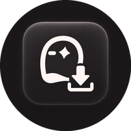
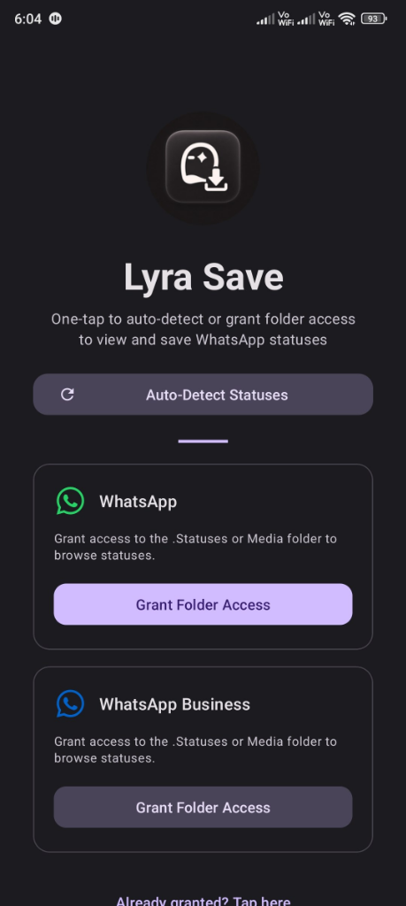
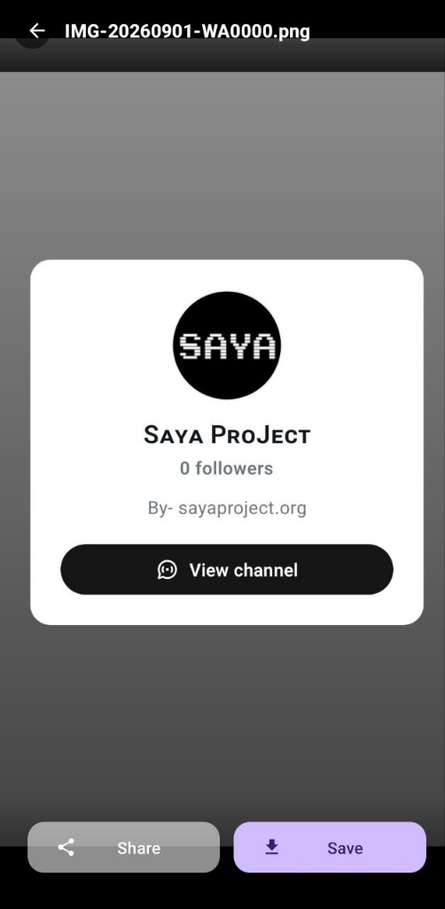
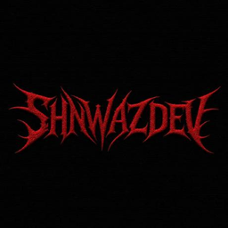

<p align="center">
  
</p>

<h1 align="center">Lyra Save</h1>

<p align="center">
  <b>Modern, High-Performance WhatsApp & WhatsApp Business Status Saver for Android</b>
</p>

<p align="center">
  <a href="https://github.com/shnwazdeveloper/LyraSave/releases/latest">
    
  </a>
  <a href="https://github.com/shnwazdeveloper/LyraSave/releases/download/v1.0/LyraSave-universal-release.apk">
    
  </a>
  
  
  
</p>

---

## Overview

**Lyra Save** is an advanced, privacy-first Android application designed to discover, preview, save, and share statuses from WhatsApp and WhatsApp Business. Built with modern Android development standards, it features Scoped Storage compliance (Android 10 to 15), background status auto-detection, skeleton shimmer loading, an in-app update notification system, and an edge-to-edge Material 3 dark interface.

---

## App Interface

<p align="center">
  
  &nbsp;&nbsp;&nbsp;&nbsp;
  
</p>

---

## Key Features

| Feature | UI Indicator | Description |
| :--- | :--- | :--- |
| **Instant Auto-Detection** |  | One-tap status discovery across regular WhatsApp, WhatsApp Business, and Dual Apps / Parallel Space directories without manual browsing. |
| **Permanent Onboarding** |  | Remembers access permanently so subsequent app launches bypass the onboarding screen and load statuses immediately. |
| **Skeleton Shimmer Loading** |  | Elegant placeholder card animations provide immediate visual feedback while indexing media files. |
| **HD Video & Image Player** |  | Immersive full-screen media viewer powered by Media3 ExoPlayer for videos and Glide for high-resolution images. |
| **Direct-to-Gallery Export** |  | Saves directly to `Pictures/LyraSave` and `Movies/LyraSave` with instant system MediaScanner synchronization. |
| **In-App Update Notifications** |  | Background release checker alerts users when updates are published, with one-tap direct APK downloading. |
| **Native Sharing Sheet** |  | Share photos and videos to social platforms seamlessly using secure Android content URIs. |

---

## Technology Stack

```
Lyra Save
├── Presentation Layer     : Material 3, ViewBinding, SwipeRefreshLayout, Edge-to-Edge Insets
├── Architecture Pattern   : MVVM (Model-View-ViewModel) + Repository Pattern
├── Asynchronous Flow      : Kotlin Coroutines & Flow
├── Media Processing       : AndroidX Media3 ExoPlayer, Bumptech Glide 4.16
├── Storage & File Access  : Scoped Storage (MediaStore API), SAF (DocumentFile), FileProvider
└── Build System           : Gradle 8.11, Android Gradle Plugin 8.7, JDK 17
```

| Component | Badge | Version / Specification |
| :--- | :--- | :--- |
| **Language** |  | 2.0.21 |
| **Target SDK** |  | Android 15 |
| **Min SDK** |  | Android 7.0 |
| **Video Engine** |  | 1.5.1 |
| **Image Loading** |  | 4.16.0 |
| **Packaging** |  | All ABIs (ARMv7, ARM64, x86, x86_64) |

---

## Installation & Download

### Direct APK Download
Grab the latest signed universal release directly from GitHub:

[](https://github.com/shnwazdeveloper/LyraSave/releases/download/v1.0/LyraSave-universal-release.apk)

### Build From Source

```bash
# Clone the repository
git clone https://github.com/shnwazdeveloper/LyraSave.git

# Navigate into the project
cd LyraSave

# Build universal release APK
./gradlew assembleRelease
```

The compiled APK will be generated at:
```
app/build/outputs/apk/release/app-release.apk
```

---

## Developer

<p align="left">
  
</p>

**SHNWAZ**  
*Web Developer & UI/UX Designer*  
*Founder @SayaProject*

[](https://github.com/shnwazdeveloper)
[](https://x.com/shnwazdev)
[](https://instagram.com/shnwazxc)
[](https://shnwaz.dev)
[](https://sayaproject.org)

---

## License

```
Copyright 2026 SHNWAZ (Saya Project)

Licensed under the Apache License, Version 2.0 (the "License");
you may not use this file except in compliance with the License.
You may obtain a copy of the License at

    http://www.apache.org/licenses/LICENSE-2.0

Unless required by applicable law or agreed to in writing, software
distributed under the License is distributed on an "AS IS" BASIS,
WITHOUT WARRANTIES OR CONDITIONS OF ANY KIND, either express or implied.
See the License for the specific language governing permissions and
limitations under the License.
```
